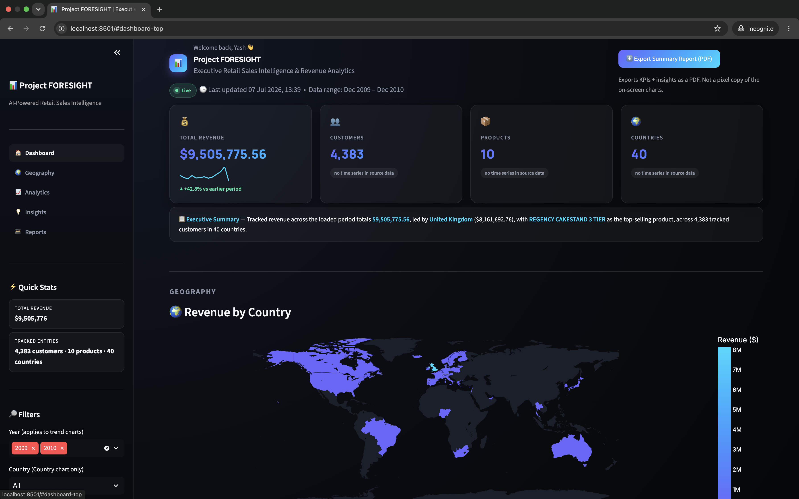
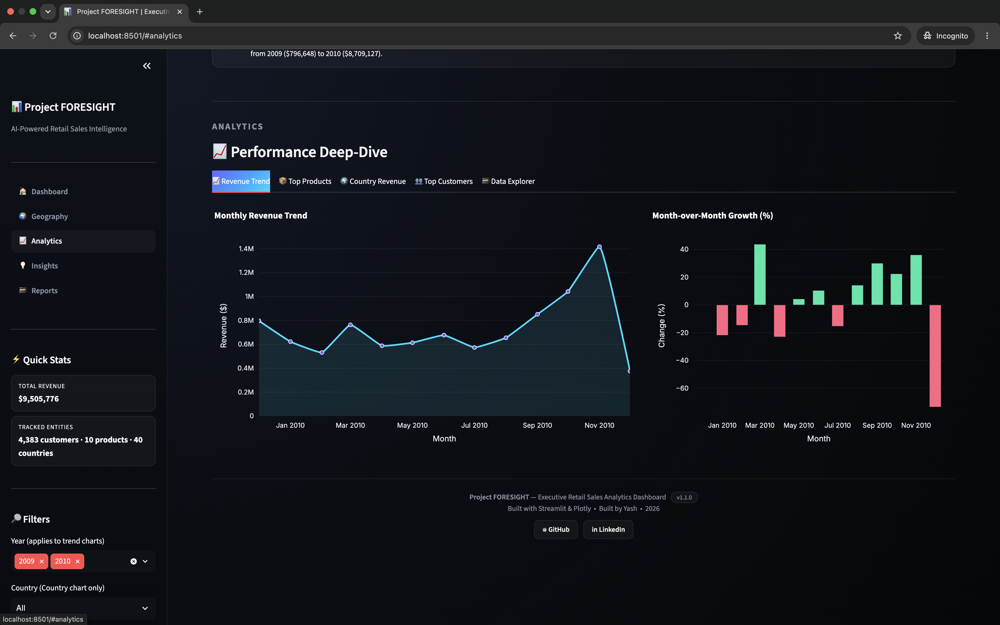
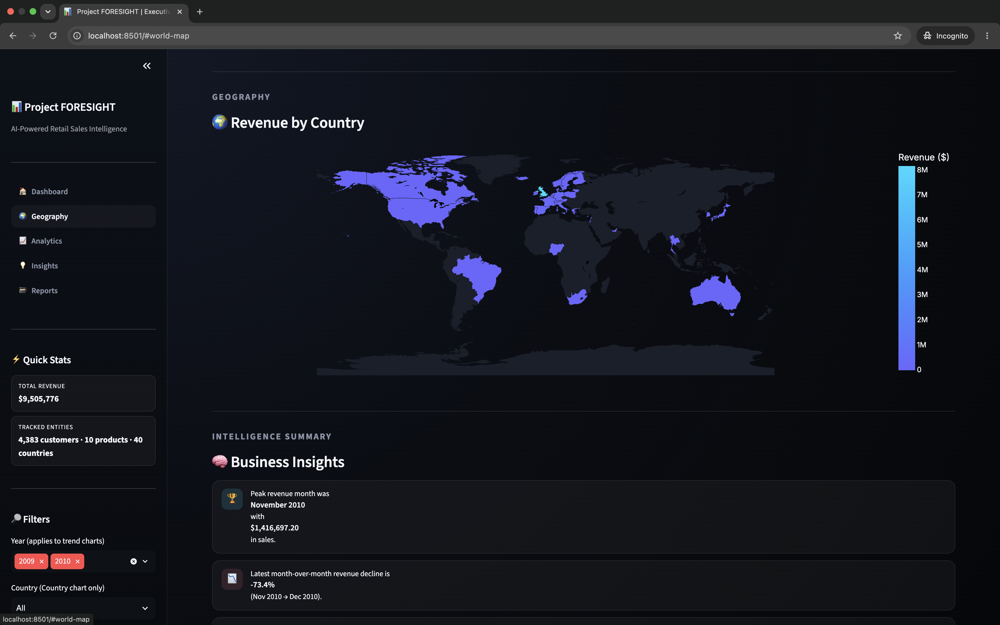
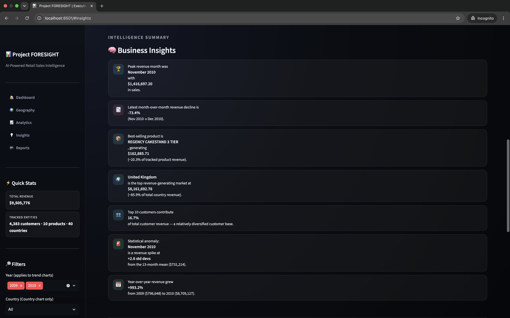

<div align="center">

# PROJECT FORESIGHT

### Retail Sales Analytics Dashboard

*An exploratory data science project that turns raw e-commerce transaction data into an interactive Streamlit dashboard.*


**[Live Demo](https://project-foresight-uk4v.onrender.com/)** · **[GitHub Repository](https://github.com/Yashr4635/Project_FORESIGHT)**

</div>

---

## Live Demo

**[project-foresight-uk4v.onrender.com](https://project-foresight-uk4v.onrender.com/)**

> ⚠️ Hosted on Render's free tier — the app sleeps after inactivity, so the first load after idle time can take 30–60 seconds to spin up. If you're sharing this link with a recruiter, mention that upfront so a slow first load doesn't read as broken.

---

## What this is

Project FORESIGHT analyzes retail transaction data through a series of Jupyter notebooks — cleaning, EDA, feature engineering, customer segmentation, demand forecasting, and inventory recommendation — and presents the output through a Streamlit dashboard deployed on Render.
## Repository Structure

This is the actual structure — nothing here is invented:

```
Project_FORESIGHT/
├── app/
│   └── app.py                   # Streamlit dashboard entry point
├── data/                        # Raw and processed datasets
├── models/                      # (currently empty — no serialized models saved yet)
├── notebooks/
│   ├── 01_Data_Cleaning.ipynb
│   ├── 02_EDA.ipynb
│   ├── 03_Feature_Engineering.ipynb
│   ├── 04_Customer_Segmentation.ipynb
│   ├── 05_Demand_Forecasting.ipynb
│   ├── 06_Inventory_Recommendation.ipynb
│   └── 07_Dashboard_Preparation.ipynb
├── reports/                      # (currently empty)
├── screenshots/
│   ├── dashboard.png
│   ├── analytics.png
│   ├── map.png
│   └── insights.png
├── src/                          # (currently empty — pipeline not yet modularized)
├── requirements.txt
└── README.md
```
---

## Pipeline (as it actually exists — notebook by notebook)

```
01_Data_Cleaning        → handle missing IDs, cancellations, duplicates
02_EDA                  → distribution, trend, and correlation analysis
03_Feature_Engineering  → RFM and time-based features
04_Customer_Segmentation→ K-Means clustering on RFM features
05_Demand_Forecasting   → category/SKU-level demand forecasting
06_Inventory_Recommendation → reorder signals from forecast output
07_Dashboard_Preparation→ aggregation for the Streamlit app
        │
        ▼
   app/app.py (Streamlit) → deployed on Render
```

---

## Dashboard

Screenshots below are the actual files from `screenshots/` — 

<div align="center">

**Executive Overview**


**Analytics View**


**Geographic Revenue**


**Business Insights**


</div>

---

## Tech Stack

| Layer | Technology |
|---|---|
| Language | Python 3.10+ |
| Data processing | Pandas, NumPy |
| Machine learning | Scikit-learn (K-Means) |
| Visualization | Plotly |
| Dashboard | Streamlit |
| Analysis environment | Jupyter Notebook |
| Deployment | Render |


## Running Locally

```bash
git clone https://github.com/Yashr4635/Project_FORESIGHT.git
cd Project_FORESIGHT

python -m venv venv
source venv/bin/activate        # Windows: venv\Scripts\activate

pip install -r requirements.txt

streamlit run app/app.py
```

Open `http://localhost:8501` in your browser.

---

## What's real vs. what needs work

Being direct about project status, because vague completeness claims fall apart under questioning:

**Done:**
- Data cleaning notebook
- EDA notebook
- Feature engineering (RFM)
- Streamlit dashboard app connected to processed data
- Customer segmentation via K-Means (notebook-based)
- Demand forecasting notebook
- Inventory recommendation notebook
- Live deployment on Render

---

## Author

**D.S. Yashaswi**
[GitHub](https://github.com/Yashr4635)

---

## License

MIT
